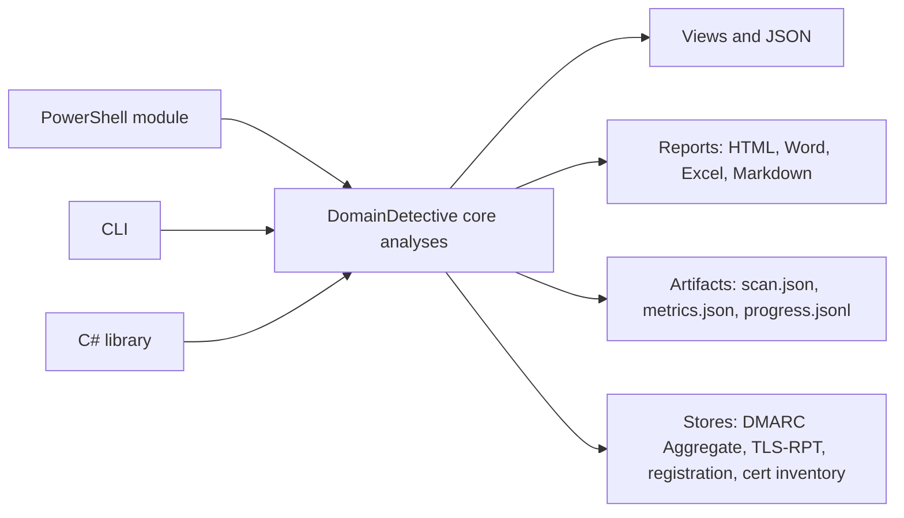

[](https://github.com/EvotecIT/DomainDetective/actions/workflows/dotnet-tests.yml)
[](https://github.com/EvotecIT/DomainDetective/actions/workflows/powershell-tests.yml)
[](https://codecov.io/gh/EvotecIT/DomainDetective)
[](https://evo.yt/discord)

# DomainDetective

DomainDetective is a domain, DNS, email, web, and certificate security toolkit for people who want repeatable checks instead of one-off website lookups. It is built around the same analysis engine and exposed through three entry points:

- A C# library for custom automation and integrations
- A PowerShell module for operational scripts and reporting
- A .NET CLI for wizard-driven scans, batch usage, artifacts, and report generation

## Choose Your Interface

| Interface | Best for | Runtime |
| --- | --- | --- |
| C# library | Custom workflows, apps, pipelines, SDK-style integration | `.NET 8` cross-platform, plus `.NET Framework 4.7.2` on Windows |
| PowerShell module | Ad-hoc investigations, scripts, scheduled jobs, exports | PowerShell `5.1` and `7+` |
| CLI | Quick scans, interactive wizard, artifacts, portable reports | `.NET 8` |

Most PowerShell checks expose both a fully-prefixed cmdlet and a friendly alias. For example, `Test-DDEmailSpfRecord` is also available as `Test-EmailSpf`.

## What It Covers

- **DNS and infrastructure**: NS, SOA, MX, delegation, reverse DNS, FCrDNS, wildcard DNS, zone transfer, TTL, EDNS, open resolver, DNS over TLS, DNS health, DNS amplification, propagation, trace, and inventory.
- **DNSSEC**: DnsClientX performs local chain, signature, and denial-proof validation; DomainDetective reports `Secure`, `Insecure`, `Bogus`, or `Indeterminate` without maintaining separate DNSSEC cryptography.
- **Email authentication and transport**: SPF, DKIM, DMARC, ARC, BIMI, MTA-STS, TLS-RPT, SMTP TLS, STARTTLS, SMTP banner, SMTP auth posture, IMAP/POP3 TLS, open relay, email validation, and mail latency.
- **Web and certificates**: HTTP posture, certificate analysis, DANE/TLSA, S/MIMEA, static website scans, redirect chains, third-party inventory, header checks, tracker hints, and technology fingerprints.
- **Registry, routing, and reputation**: WHOIS, RDAP, RPKI, DNSBL, threat intel hooks, VirusTotal helpers, search engine checks, and domain suggestions/search.
- **Discovery and exposure**: CT timeline, subdomain discovery, certificate inventory, autodiscover, security.txt, contact TXT, directory exposure, and identity provider hints.
- **Outputs and reporting**: JSON, HTML, Word, Excel, Markdown, and MarkdownHtml, plus JSON artifacts for repeated runs and time-series stores. PDF is planned through OfficeIMO once the dependency-free package path is available.

## How It Fits Together



## Website and Online Tools

The repository also includes the public website and the online tools experience:

- `Website` builds the static marketing/docs/API site into `Website/_site`
- `DomainDetective.Website` contains the Blazor WebAssembly tools app that is published into `Website/_site/tools`
- `DomainDetective.OnlineHost` serves the built site and exposes same-origin `/tool-api` endpoints for checks that browsers cannot perform directly

Build the full website stack:

```powershell
pwsh ./Website/build.ps1 -Fast
```

Run the website regression suite:

```powershell
dotnet test ./DomainDetective.Website.Tests/DomainDetective.Website.Tests.csproj --configuration Release --framework net10.0
```

Run the local online host after the build:

```powershell
dotnet run --project ./DomainDetective.OnlineHost/DomainDetective.OnlineHost.csproj --urls http://localhost:8097
```

Then open:

- `http://localhost:8097/` for the static site
- `http://localhost:8097/tools/` for the online tools
- `http://localhost:8097/tool-api/health` to confirm the hosted analysis API is available

Why the host matters:

- DNS-style lookups can run directly in the browser through DNS-over-HTTPS
- HTTP header inspection, `security.txt`, certificate analysis, and some richer probes need a hosted backend because browsers cannot reliably inspect remote TLS handshakes or arbitrary cross-origin responses
- Hosted-first checks include HTTP headers, `security.txt`, certificate analysis, MTA-STS policy retrieval, RDAP, and BIMI indicator/logo fetches
- A static-only deployment such as GitHub Pages will publish the site, but it will not provide `/tool-api`
- Production deployments should serve the site through `DomainDetective.OnlineHost` or an equivalent reverse proxy/application host that exposes the same `/tool-api` endpoints

### Website PR Checklist

The website validation commands and CI notes now live in [CONTRIBUTING.md](./CONTRIBUTING.md) so there is one source of truth for contributor workflows.

## Quick Start

### PowerShell

Import the local module from the repository and run a few common checks:

```powershell
Import-Module ./Module/DomainDetective.psd1 -Force

Test-DomainHealth -DomainName "example.com"
Test-EmailSpf -DomainName "example.com"
Test-Website -DomainName "example.com"
```

Export a report directly from a scan:

```powershell
Import-Module ./Module/DomainDetective.psd1 -Force

Test-DomainHealth `
    -DomainName "example.com" `
    -ExportFormat Html `
    -ExportPath ".\artifacts\example-domain-report.html" `
    -OpenInBrowser
```

Compose multi-check reports from pipeline output:

```powershell
Import-Module ./Module/DomainDetective.psd1 -Force

Export-DDSecurityReport -ExportFormat Word -ExportPath ".\artifacts\example-email-auth.docx" {
    Test-EmailSpf -DomainName "example.com"
    Test-EmailDkim -DomainName "example.com"
    Test-EmailDmarc -DomainName "example.com"
}
```

To discover the available PowerShell surface:

```powershell
Get-Command -Module DomainDetective
```

### CLI

The repository currently exposes the CLI as a normal .NET application, not as an installed global or local `dotnet tool`. The supported ways to run it today are:

- `dotnet run --project DomainDetective.CLI -- ...` while developing from source
- `dotnet publish` and then running the generated app from the publish directory

Run the interactive wizard:

```bash
dotnet run --project DomainDetective.CLI --
```

Run a direct health check:

```bash
dotnet run --project DomainDetective.CLI -- check example.com --json
```

Generate a report with artifacts:

```bash
dotnet run --project DomainDetective.CLI -- GenerateReport example.com --format html --output ./artifacts/example.html
```

A few other common entry points:

```bash
dotnet run --project DomainDetective.CLI -- AnalyzeMessageHeader --file ./headers.txt --json
dotnet run --project DomainDetective.CLI -- DnsPropagation --domain example.com --record-type A
dotnet run --project DomainDetective.CLI -- ValidateEmail user@example.com --smtp --catch-all
dotnet run --project DomainDetective.CLI -- --help
```

Publish a local copy of the CLI:

```bash
dotnet publish DomainDetective.CLI/DomainDetective.CLI.csproj -c Release -o ./artifacts/cli
```

Then run the published app:

```powershell
.\artifacts\cli\DomainDetective.CLI.exe --help
```

```bash
./artifacts/cli/DomainDetective.CLI --help
```

Or use the build script introduced in this repository:

```powershell
pwsh ./Build/Publish-CLI.ps1
```

That script publishes runtime-specific CLI artifacts under `Artifacts/ProjectBuild/CLI` and creates friendly aliases such as `DD.exe` on Windows and `DD` on Unix-like targets.

### C#

The example project in [`DomainDetective.Example`](./DomainDetective.Example) shows many protocol-specific flows. The simplest library usage looks like this:

```csharp
using DomainDetective;

var healthCheck = new DomainHealthCheck();
await healthCheck.Verify("example.com");

Console.WriteLine(healthCheck.ToJson());
```

### Optional Packages

Dependency-heavy features are now split into optional packages so the base `DomainDetective` package can stay leaner:

- `DomainDetective.Pgp` enables PGP-backed `security.txt` signature verification
- `DomainDetective.Visual` enables Playwright/ImageSharp-powered visual typosquatting capture and fingerprinting
- `DomainDetective.CtSql` enables DbaClientX-backed crt.sh PostgreSQL CT metadata enrichment

Registration is explicit on purpose so app startup stays predictable for trimming and AOT scenarios:

```csharp
using DomainDetective;
using DomainDetective.CtSql;
using DomainDetective.Pgp;
using DomainDetective.Visual;

DomainDetectiveCtSqlRegistration.Register();
DomainDetectivePgpRegistration.Register();
DomainDetectiveVisualRegistration.Register();

var healthCheck = new DomainHealthCheck();
await healthCheck.Verify("example.com");
```

## Key Commands

### PowerShell

| Cmdlet | Purpose |
| --- | --- |
| `Test-DomainHealth` | Run a broad domain posture assessment |
| `Test-EmailSpf` | Validate SPF policy and lookup behavior |
| `Test-EmailDkim` | Inspect DKIM selectors and key strength |
| `Test-EmailDmarc` | Validate DMARC policy and reporting |
| `Test-Website` | Run combined web/certificate posture checks |
| `Test-DnsPropagation` | Query propagation across multiple resolvers |
| `Test-DesiredState` | Compare a domain to an organization baseline |
| `Invoke-DDCertificateInventory` | Capture certificate inventory snapshots |
| `Export-DDSecurityReport` | Build HTML, Word, Excel, or Markdown reports from checks |

### CLI

| Command | Purpose |
| --- | --- |
| `wizard` | Run the interactive scan wizard |
| `check` | Run direct health checks against one or more domains |
| `GenerateReport` | Generate reports and artifacts |
| `DesiredState` | Evaluate a custom baseline against a domain |
| `ValidateEmail` | Validate an email address with optional SMTP probing |
| `AnalyzeMessageHeader` | Parse and inspect raw mail headers |
| `AnalyzeARC` | Analyze ARC headers |
| `DnsPropagation` | Check resolver propagation |
| `CertificateInventoryCapture` | Capture certificate inventory snapshots |
| `CertificateInventorySummary` | Summarize stored certificate inventory snapshots |
| `CertificateInventoryRisk` | Assess persisted certificate risk posture |
| `RunsList` / `RunsOpen` | Browse and open recent artifact runs |

## Output and Ordering

### Output Layers

- `Raw`: strongly-typed analysis models suitable for automation and downstream processing.
- `Narrative`: human-friendly summaries for CLI and PowerShell views.
- `Highlights`: concise status, counts, and key findings for quick review.

### Report Ordering

- `DomainOrder`: `Alphabetical` or `Input`
- `SectionOrderMode`: `Canonical`, `Input`, or `Custom`
- `SectionOrder`: explicit section keys when using `Custom`

Canonical per-domain section order:

`MX`, `SPF`, `DKIM`, `DMARC`, `DMARC Aggregate`, `ARC`, `BIMI`, `DNSBL`, `RPKI`, `Registration`, `NS`, `SOA`, `TTL`, `ZoneTransfer`, `Wildcard`, `CAA`, `Classification`, `MTA-STS`, `TLS-RPT`, `TLS-RPT Reports`, `MAILTLS`, `DNSSEC`, `DANE`

Executive summary columns remain canonical across formats; ordering affects per-domain sections only.

## Available Cmdlets and Aliases

### Email

| Prefixed Name | Alias Name | Purpose |
| --- | --- | --- |
| `Test-DDEmailArcRecord` | `Test-EmailArc` | Validate ARC headers |
| `Test-DDEmailAutoDiscover` | `Test-EmailAutoDiscover` | Check mail client discovery |
| `Test-DDEmailAddress` | `Test-EmailAddress` | Validate mailbox reachability |
| `Test-DDEmailBimiRecord` | `Test-EmailBimi` | Verify BIMI record |
| `Test-DDEmailDkimRecord` | `Test-EmailDkim` | Verify DKIM selectors |
| `Test-DDEmailDmarcRecord` | `Test-EmailDmarc` | Verify DMARC policy |
| `Test-DDEmailSpfRecord` | `Test-EmailSpf` | Verify SPF policy |
| `Test-DDEmailTlsRptRecord` | `Test-EmailTlsRpt` | Inspect TLS-RPT |
| `Test-DDEmailMtaSts` | `Test-EmailMtaSts` | Verify MTA-STS policy |
| `Test-DDEmailStartTls` | `Test-EmailStartTls` | Check STARTTLS advertisement |
| `Test-DDEmailSmtpTls` | `Test-EmailSmtpTls` | Check SMTP TLS posture |
| `Test-DDEmailProtocolTls` | `Test-EmailProtocolTls` | SMTP/IMAP/POP3 TLS checks |
| `Test-DDEmailOpenRelay` | `Test-EmailOpenRelay` | Detect open SMTP relay |
| `Get-DDEmailMessageHeaderInfo` | `Get-EmailHeaderInfo` | Parse raw email headers |
| `Test-DDEmailLatency` | `Test-EmailLatency` | Measure SMTP responsiveness |
| `Test-DDEmailImapTls` | `Test-EmailImapTls` | IMAP TLS check |
| `Test-DDEmailPop3Tls` | `Test-EmailPop3Tls` | POP3 TLS check |
| `Test-DDEmailSmtpBanner` | `Test-EmailSmtpBanner` | Inspect SMTP banner |
| `Test-DDDmarcAggregate` | `Test-EmailDmarcAggregate` | Parse DMARC aggregate reports |
| `New-DDDmarcRecord` | `New-DmarcRecord` | Build a DMARC record |

### Web

| Prefixed Name | Alias Name | Purpose |
| --- | --- | --- |
| `Test-DDWebsite` | `Test-Website` | Combined website check (certificate plus HTTP posture) |
| `Test-DDWebsiteSecurity` | `Test-WebsiteSecurity` | HTTPS security headers and mixed content |
| `Test-DDDomainCertificate` | `Test-DomainCertificate` | Website certificate and TLS grade |
| `Test-DDWebsiteStaticScan` | `Test-WebsiteStaticScan` | Static website crawl and resource analysis |

### DNS

| Prefixed Name | Alias Name | Purpose |
| --- | --- | --- |
| `Test-DDDnsCaaRecord` | `Test-DnsCaa` | Verify CAA |
| `Test-DDDnsNsRecord` | `Test-DnsNs` | Verify NS |
| `Test-DDDnsSoaRecord` | `Test-DnsSoa` | Verify SOA |
| `Test-DDDnsSecStatus` | `Test-DnsSec` | Verify DNSSEC |
| `Test-DDDnsBlacklist` | `Test-DnsBlacklist` | Check DNSBL (domain and MX IPs) |
| `Test-DDMailDomainClassification` | - | Classify sending, receiving, parked, and related signals |
| `Test-DDDnsOpenResolver` | `Test-DnsOpenResolver` | Detect open resolver |
| `Test-DDDnsDanglingCname` | `Test-DnsDanglingCname` | Find dangling CNAME |
| `Test-DDDnsPropagation` | `Test-DnsPropagation` | Check global propagation |
| `Start-DDDnsPropagationMonitor` | `Start-DnsPropagationMonitor` | Start propagation monitor |
| `Stop-DDDnsPropagationMonitor` | `Stop-DnsPropagationMonitor` | Stop propagation monitor |
| `Test-DDDnsTtl` | `Test-DnsTtl` | TTL analysis |
| `Test-DDDnsTunneling` | `Test-DnsTunneling` | Detect DNS tunneling from logs |
| `Test-DDDnsWildcard` | `Test-DnsWildcard` | Detect wildcard catch-all behavior |
| `Test-DDDnsEdnsSupport` | `Test-DnsEdnsSupport` | EDNS support |
| `Test-DDDnsHealth` | `Test-DnsHealth` | Authoritative SOA, apex, and TTL consistency |
| `Test-DDDnsSmimeaRecord` | `Test-DnsSmimea` | S/MIMEA |
| `Test-DDDnsForwardReverse` | `Test-DnsFcrDns` | FCrDNS |
| `Test-DDDnsMxRecord` | `Test-DnsMx` | MX records |
| `Test-DDDnsDelegation` | `Test-DnsDelegation` | Parent NS and glue consistency |
| `Test-DDDnsReverseDns` | `Test-DnsReverseDns` | Reverse DNS |
| `Test-DDDnsZoneTransfer` | `Test-DnsZoneTransfer` | AXFR exposure |
| `Test-DDDnsAmplification` | `Test-DnsAmplification` | DNS amplification posture |
| `Test-DDDnsOverTls` | `Test-DnsOverTls` | DNS over TLS |

### Domain

| Prefixed Name | Alias Name | Purpose |
| --- | --- | --- |
| `Test-DDDomainContactRecord` | `Test-DomainContact` | WHOIS contact sanity |
| `Test-DDDomainSecurityTxt` | `Test-DomainSecurityTxt` | `security.txt` checks |
| `Test-DDDomainCertificate` | `Test-DomainCertificate` | Website certificate checks |
| `Test-DDDomainOverallHealth` | `Test-DomainHealth` | Composite health view with export support |
| `Test-DDDesiredState` | `Test-DesiredState` | Validate a domain against a desired-state baseline |
| `Get-DDDomainWhois` | `Get-DomainWhois` | WHOIS |
| `Get-DDDomainFlattenedSpfIp` | `Get-DomainFlattenedSpfIp` | Flatten SPF to IPs |
| `Test-DDDomainThreatIntel` | `Test-DomainThreatIntel` | Threat intel lookups |
| `Get-DDRdap` | `Get-Rdap` | RDAP |
| `Get-DDRdapObject` | `Get-RdapObject` | RDAP raw object |
| `Get-DDSearchEngineInfo` | `Get-SearchEngineInfo` | Search engine queries |
| `Get-DDIdpInfo` | `Get-IdpInfo` | Identity provider hints |

### TLS and Networking

| Prefixed Name | Alias Name | Purpose |
| --- | --- | --- |
| `Test-DDTlsDaneRecord` | `Test-TlsDane` | DANE/TLSA |
| `Get-DDTlsCertificateInfo` | `Get-CertificateInfo` | Parse PEM and DER certificates |
| `Test-DDNetworkIpNeighbor` | `Test-NetworkIpNeighbor` | IP neighbors |
| `Test-DDNetworkPortAvailability` | `Test-NetworkPortAvailability` | Port availability |
| `Test-DDNetworkPortScan` | `Test-NetworkPortScan` | Port scan profiles |
| `Test-DDRpki` | `Test-Rpki` | RPKI validation |

### Configuration and Data

| Prefixed Name | Alias Name | Purpose |
| --- | --- | --- |
| `Add-DDDnsblProvider` | `Add-DnsblProvider` | Manage DNSBL providers |
| `Remove-DDDnsblProvider` | `Remove-DnsblProvider` | Manage DNSBL providers |
| `Clear-DDDnsblProviderList` | `Clear-DnsblProvider` | Manage DNSBL providers |
| `Import-DDDnsblConfig` | `Import-DnsblConfig` | Import DNSBL provider configuration |
| `Import-DDDmarcReport` | `Import-DmarcReport` | Import DMARC aggregate zip |
| `Import-DDDmarcForensic` | `Import-DmarcForensic` | Import DMARC forensic zip |
| `Import-DDEmailTlsRpt` | `Import-EmailTlsRpt` | Import TLS-RPT JSON |
| `Set-DDExportOptions` | `Set-ExportOptions` | Set default export/report options |
| `Set-DDPersona` | `Set-DDNarrator` | Set narration persona |

### Time Series and Inventory

| Prefixed Name | Alias Name | Purpose |
| --- | --- | --- |
| `Import-DDDmarcAggregateSnapshot` | `Import-DmarcAggregateSnapshot` | DMARC aggregate snapshots into a store |
| `Get-DDDmarcAggregateTimeSeries` | `Get-DmarcAggregateTimeSeries` | DMARC aggregate time-series view |
| `Import-DDTlsRptReportSnapshot` | `Import-TlsRptReportSnapshot` | TLS-RPT reports into a store |
| `Get-DDTlsRptReportsTimeSeries` | `Get-TlsRptReportsTimeSeries` | TLS-RPT reports time-series view |
| `Import-DDRegistrationSnapshot` | `Import-RegistrationSnapshot` | WHOIS and RDAP registration snapshot into a store |
| `Get-DDRegistrationDrift` | `Get-RegistrationDrift` | Registration drift view |
| `Invoke-DDCertificateInventory` | - | Capture certificate inventory snapshots |
| `Get-DDCertificateInventorySnapshot` | - | Read persisted certificate inventory snapshots |
| `Get-DDCertificateInventorySummary` | `Get-CertificateInventorySummary` | Summarize inventory snapshots |
| `Get-DDCertificateInventoryRisk` | `Get-CertificateInventoryRisk` | Evaluate risk across snapshots |
| `Get-DDCertificateInventoryDrift` | `Get-CertificateInventoryDrift` | Detect certificate drift |
| `Get-DDCertificateInventoryPolicy` | `Get-CertificateInventoryPolicy` | Evaluate inventory against policy |
| `Get-DDCertificateInventoryReuse` | `Get-CertificateInventoryReuse` | Map certificate reuse |

## Email Address Validation

PowerShell:

```powershell
Test-DDEmailAddress -EmailAddress "user@example.com" -SmtpProbe -CheckCatchAll
```

CLI:

```bash
dotnet run --project DomainDetective.CLI -- ValidateEmail user@example.com --smtp --catch-all --smtp-max-hosts 2
```

Custom SMTP rules:

```powershell
Test-DDEmailAddress -EmailAddress "user@example.com" -SmtpProbe -SmtpRulesPath "./smtp-rules.json"
```

```bash
dotnet run --project DomainDetective.CLI -- ValidateEmail user@example.com --smtp --smtp-rules ./smtp-rules.json --no-builtin-smtp-rules
```

Useful controls:

- `-EnableProviderWebChecks` or `--provider-web` enables provider-specific web checks when available.
- `-ProtonAuthCookie` and `-ProtonUid` or `--proton-auth` and `--proton-uid` enable Proton-specific checks.
- `-SmtpRulesPath` or `--smtp-rules` supplies custom SMTP rules JSON.
- `-DisableBuiltinSmtpRules` or `--no-builtin-smtp-rules` ignores built-in SMTP rules.
- `-AllowB2CCatchAll` or `--allow-b2c-catch-all` allows catch-all probing for consumer providers.
- `-AllowInvalidSmtpCertificates` or `--smtp-allow-invalid-cert` skips SMTP TLS certificate validation.
- `-SmtpTimeoutSeconds`, `-SmtpRetryDelaySeconds`, and `-SmtpProbeDelaySeconds` tune SMTP timing and pacing.
- `-B2CProvidersPath` and `-DisableFreeProvidersAsB2C` control B2C provider classification behavior.

Notes:

- Built-in SMTP rules are enabled by default.
- See [`Docs/EmailSmtpRules.md`](./Docs/EmailSmtpRules.md) for schema, examples, and Proton auth notes.
- Provider web checks rely on undocumented endpoints and may change or rate-limit without notice.
- Avoid passing Proton auth values through command history when possible.
- SMTP probing can trigger provider abuse protections during bulk runs.

## Common Workflows

### 1. Domain Health and Reporting

PowerShell:

```powershell
Import-Module ./Module/DomainDetective.psd1 -Force

Test-DomainHealth -DomainName "example.com" -ExportFormat Html -ExportPath ".\Reports\example.html"
```

CLI:

```bash
dotnet run --project DomainDetective.CLI -- GenerateReport example.com --format word --output ./Reports/example.docx
```

Use this path when you want a broad posture report covering DNS, email, web, certificates, and selected discovery sections.

### 2. Desired State Baselines

Use Desired State when "best practice" is not enough and you need to compare domains to your own organization-specific baseline.

PowerShell:

```powershell
Import-Module ./Module/DomainDetective.psd1 -Force

$baseline = New-DesiredState {
    New-DDDesiredStateSpf -Enabled $true -MaxDnsLookups 10
    New-DDDesiredStateDmarc -Enabled $true -AllowedPolicies reject
}

Test-DesiredState -DomainName "example.com" -Configuration $baseline
```

CLI:

```bash
dotnet run --project DomainDetective.CLI -- DesiredState example.com --desired-state ./desired-state.json --format html --output ./Reports/desired-state.html
```

Deep dive: [`Docs/DESIRED_STATE.MD`](./Docs/DESIRED_STATE.MD)

### 3. Certificate Inventory and Drift

Use certificate inventory when you need portfolio-wide visibility, persistence, drift tracking, or policy/risk reporting across many domains and endpoints.

PowerShell:

```powershell
Import-Module ./Module/DomainDetective.psd1 -Force

Invoke-DDCertificateInventory `
    -DomainName "example.com","example.org" `
    -CacheDirectory .\cert-monitor `
    -ReuseRecentResults `
    -RecentResultTtlHours 24 `
    -IncludeCtSubdomains `
    -VerifyCtSubdomains

# Explicit endpoints can be captured without a domain list. This performs AUTH TLS before the TLS handshake.
Invoke-DDCertificateInventory `
    -Endpoint ftps-explicit://ftp.example.com:21 `
    -DetectServices `
    -ProbeVantage branch-office `
    -NoPersist
```

CLI:

```bash
dotnet run --project DomainDetective.CLI -- CertificateInventoryCapture example.com example.org --include-ct-subdomains --verify-ct-subdomains
dotnet run --project DomainDetective.CLI -- cert-inventory-capture --endpoint ftps-explicit://ftp.example.com:21 --detect-services --probe-vantage branch-office --no-persist
dotnet run --project DomainDetective.CLI -- CertificateInventorySummary --since-utc 2026-01-01
dotnet run --project DomainDetective.CLI -- CertificateInventoryRisk --expiring-within-days 30 --json
```

Deep dive: [`Docs/CERTIFICATE_INVENTORY.MD`](./Docs/CERTIFICATE_INVENTORY.MD)

### 4. Time-Series Ingestion

DomainDetective can persist DMARC aggregate, TLS-RPT, and registration snapshots so reports can include historical sections instead of only point-in-time checks.

```bash
dotnet run --project DomainDetective.CLI -- ImportDmarcAggregateSnapshot ./Reports/DMARC --store-path ./Store
dotnet run --project DomainDetective.CLI -- ImportTlsRptReportSnapshot example.com ./Reports/TLSRPT --store-path ./Store
dotnet run --project DomainDetective.CLI -- ImportRegistrationSnapshot example.com --store-path ./Store
dotnet run --project DomainDetective.CLI -- GenerateReport example.com --format html --store-path ./Store
```

## Reports and Artifacts

### Output Formats

| Format | Notes |
| --- | --- |
| HTML | Best overall interactive/default report experience |
| Word | Strong for executive and shareable document output |
| Excel | Useful for matrix/dashboard and analyst workflows |
| Markdown | Lightweight document output |
| MarkdownHtml | HTML generated from the Markdown-style layout |
| JSON | Best for automation and downstream tooling |
| PDF | Planned through OfficeIMO PDF after the dependency-free package path is available |

### Artifact Layout

Coordinated runs emit structured artifacts under `artifacts/<subject>/<timestamp>/`.

Typical files:

- `scan.json`: metadata, summary, recommendations, and the full `DomainHealthCheck`
- `metrics.json`: counters and timing
- `progress.jsonl`: progress stream for long-running runs
- `index.jsonl`: subject-level run index used by `RunsList` and `RunsOpen`

List or open recent CLI runs:

```bash
dotnet run --project DomainDetective.CLI -- RunsList --subject example.com --count 5
dotnet run --project DomainDetective.CLI -- RunsOpen --subject example.com
```

### Report Composition

Compose any mix of exportable views through the pipeline:

```powershell
Import-Module ./Module/DomainDetective.psd1 -Force

$spf = Test-DDEmailSpfRecord -DomainName "evotec.pl"
$dnsbl = Test-DDDnsBlacklist -NameOrIpAddress "evotec.pl"

($spf + $dnsbl) | Export-DDSecurityReport -Scope Detailed -ExportFormat Word -ExportPath .\Reports -OpenReport
```

Or use an inline script block:

```powershell
Import-Module ./Module/DomainDetective.psd1 -Force

Export-DDSecurityReport -Scope Detailed -ExportFormat Markdown -ExportPath .\Reports {
    Test-DDEmailSpfRecord -DomainName "evotec.pl","evotec.xyz"
    Test-DDEmailDkimRecord -DomainName "evotec.pl","evotec.xyz"
    Test-DDEmailDmarcRecord -DomainName "evotec.pl","evotec.xyz"
    Test-DDDnsNsRecord -DomainName "evotec.pl"
    Test-DDDnsSecStatus -DomainName "evotec.pl"
}
```

Metadata can be set globally:

```powershell
Set-DDExportOptions -Title "Evotec - Q3 Portfolio Review" -Subject "Executive summary and remediation plan" -Category "Email Security" -Keywords "SPF,DKIM,DMARC" -Creator "Evotec"
```

Or per report:

```powershell
Export-DDSecurityReport -ExportFormat Word -Title "Evotec - MX Review" -Subject "MX and transport policies"
```

## Configuration Notes

- Most DNS-aware operations accept `-DnsEndpoint` to control resolution.
- Multi-resolver scenarios also support `-DnsEndpoints` and `-MultiResolverStrategy`.
- DNS propagation supports additional scope controls such as `-Country`, `-Location`, and `-Take`.
- WHOIS can compare current state to stored snapshots with `-SnapshotPath` and `-Diff`.
- Time-series features use `-StorePath`.
- Output formats include HTML, Word, Excel, PDF, Markdown, MarkdownHtml, and JSON, though support varies by cmdlet.

## DNSBL Configuration

DNSBL providers can be customized at runtime. The built-in list can be extended, replaced, or filtered depending on how you want blacklist checks to behave.

Useful actions:

- Add providers
- Remove providers
- Clear the current list
- Load providers from JSON

C#:

```csharp
var analysis = new DNSBLAnalysis();

analysis.AddDNSBL("dnsbl.example.com", comment: "custom");
analysis.RemoveDNSBL("dnsbl.example.com");
analysis.ClearDNSBL();
analysis.LoadDnsblConfig("DnsblProviders.json", overwriteExisting: true);
```

PowerShell:

```powershell
Add-DnsblProvider -Domain "dnsbl.example.com" -Comment "custom"
Remove-DnsblProvider -Domain "dnsbl.example.com"
Clear-DnsblProvider
Import-DnsblConfig -Path "./DnsblProviders.json" -OverwriteExisting
```

Useful flags:

- `-TreatAsDomain` forces domain mode
- `-TreatAsIp` forces IP mode
- `-MaxConcurrency` hints concurrency to the resolver
- `-BlacklistedOnly` returns only listed results

## Protocol Notes

### Website Certificates

Certificate analysis includes:

- `KeyAlgorithm` and `KeySize`
- `WeakKey` for keys under 2048 bits
- `Sha1Signature`
- `IsSelfSigned`
- `PresentInCtLogs`
- optional TLS negotiation details when capture is enabled
- optional revocation skipping via `SkipRevocation`

Combined website checks return a single summary object:

```powershell
Test-Website -DomainName "evotec.xyz" | Select-Object Area,Check,Status,Summary,CertificateGrade,HttpGrade
```

### DKIM

DKIM analysis exposes indicators such as:

- `WeakKey`
- `OldKey`
- `DeprecatedTags`

### SMTP TLS

SMTP TLS analysis stores the negotiated certificate and reports expiration details and chain validity for each server.
Direct SMTP, IMAP, and POP3 TLS checks can also pin a backend address while keeping the public hostname for SNI and certificate validation:

```powershell
$tls = Test-DDEmailSmtpTls -HostName 'mail.example.com' -Port 587 `
    -ConnectAddress '192.0.2.10' -AddressFamily IPv4
$tls.Servers | Select-Object HostName, ConnectAddress, RemoteAddress, HostnameMatch, Grade
```

Use `-AddressFamily IPv4` or `-AddressFamily IPv6` without `-ConnectAddress` to test only one DNS address family. The result keeps both the requested target and the remote address observed after connecting.
`Test-DDEmailStartTls` accepts the same transport targeting options for STARTTLS advertisement checks, but use the protocol TLS cmdlets when certificate identity and negotiation evidence are required.

### HTTP Security Headers

HTTP posture checks inspect common security headers including:

- `Content-Security-Policy`
- `Referrer-Policy`
- `X-Frame-Options`
- `Permissions-Policy`
- cross-origin policy headers

`HttpAnalysis` also tracks HSTS preload membership and computes a coarse grade from `A` through `F`.

## Repository Map

```text
DomainDetective/                Core analyzers, models, and protocol logic
DomainDetective.Pgp/            Optional PGP-backed security.txt verification
DomainDetective.Visual/         Optional Playwright/ImageSharp visual analysis helpers
DomainDetective.CtSql/          Optional DbaClientX-backed crt.sh PostgreSQL CT provider
DomainDetective.PowerShell/     Compiled PowerShell cmdlets
DomainDetective.CLI/            Spectre.Console CLI and wizard
DomainDetective.Reports/        Shared reporting abstractions and dispatch
DomainDetective.Reports.Html/   HTML composition reports
DomainDetective.Reports.Office/ Word and Excel reports
DomainDetective.Reports.Markdown/ Markdown and MarkdownHtml reports
DomainDetective.Example/        C# usage samples
Module/                         Importable module manifest, scripts, and PowerShell examples
Docs/                           Focused feature documentation
DomainDetective.Tests/          Core and PowerShell-facing tests
DomainDetective.CLI.Tests/      CLI tests
```

If you want runnable PowerShell examples, start in [`Module/Examples`](./Module/Examples). If you want C# samples, start in [`DomainDetective.Example`](./DomainDetective.Example).

## Build and Test

Restore, build, and run the main test suites:

```bash
dotnet restore DomainDetective.sln
dotnet build DomainDetective.sln
dotnet test DomainDetective.Tests/DomainDetective.Tests.csproj
dotnet test DomainDetective.CLI.Tests/DomainDetective.CLI.Tests.csproj
```

Run the PowerShell test harness:

```powershell
pwsh ./Module/DomainDetective.Tests.ps1
```

## Packaging and Publish

`Build/project.build.json` follows the shared PSPublishModule project-build schema and is the source of truth for NuGet package selection, version tracks, signing, and publish/release defaults. `Build/cli.build.json` keeps the CLI runtime matrix used by the local CLI publish wrapper.

The PSPublishModule wrapper requires PSPublishModule to be available in the running PowerShell session:

```powershell
Install-Module PSPublishModule -Scope CurrentUser
```

NuGet packages:

```powershell
pwsh ./Build/Build-NuGet.ps1 -Version 0.2.0
```

CLI publish artifacts:

```powershell
pwsh ./Build/Publish-CLI.ps1 -Version 0.2.0
```

Run the schema-driven NuGet/release pipeline through the PSPublishModule wrapper:

```powershell
pwsh ./Build/Build-Project.ps1 -Plan
pwsh ./Build/Build-Project.ps1 -Build
```

The wrapper is intentionally small and delegates to PSPublishModule:

```powershell
Invoke-ProjectBuild -ConfigPath .\Build\project.build.json -Plan
Invoke-ProjectBuild -ConfigPath .\Build\project.build.json -Build
```

NuGet and GitHub publish credentials are resolved from `NUGET_API_KEY` and `GITHUB_TOKEN` when publishing is enabled.

Preview the plan without executing:

```powershell
pwsh ./Build/Build-Project.ps1 -Plan
```

Write the resolved plan to a file:

```powershell
pwsh ./Build/Build-Project.ps1 -Plan -PlanPath .\Artifacts\ProjectBuild\custom-build-plan.json
```

Enable publish actions explicitly when needed:

```powershell
pwsh ./Build/Build-Project.ps1 -Build -PublishNuget
pwsh ./Build/Build-Project.ps1 -PublishGitHub
```

Outputs are staged under `Artifacts/ProjectBuild`:

- `Artifacts/ProjectBuild/NuGet` for `.nupkg` files
- `Artifacts/ProjectBuild/packages` for PSPublishModule project-build packages
- `Artifacts/ProjectBuild/releases` for PSPublishModule release archives
- `Artifacts/ProjectBuild/CLI/<runtime>` for published CLI folders
- `Artifacts/ProjectBuild/CLI/*.zip` for runtime archives when zipping is enabled
- `Artifacts/ProjectBuild/build.plan.json` for the default resolved build plan

GitHub Actions currently validate:

- `.NET 8` on Windows, Linux, and macOS
- `.NET Framework 4.7.2` tests on Windows
- PowerShell `5.1` and `7+`

## Understanding Results

Each analysis returns structured properties that map closely to the relevant RFCs or protocol expectations. That means the objects are meant to be usable in automation, not just rendered for humans.

Examples:

- SPF follows RFC 7208 lookup counting behavior and exposes resolved include and redirect chains.
- DKIM tracks minimum key expectations and sets `WeakKey` when RSA keys are too small.
- DMARC aligns policy, reporting, and enforcement posture.
- DANE and S/MIMEA follow their respective record semantics instead of just returning raw TXT strings.

WHOIS and summary data can also surface:

- expiration dates
- registrar lock state
- public suffix detection

C# example:

```csharp
var health = new DomainHealthCheck();
await health.Verify("example.com");
var summary = health.BuildSummary();

Console.WriteLine($"Expires on: {summary.ExpiryDate}");
Console.WriteLine($"Registrar lock: {summary.RegistrarLocked}");
Console.WriteLine($"Is public suffix: {summary.IsPublicSuffix}");
```

For unified WHOIS and RDAP snapshots with structured drift:

```powershell
Import-DDRegistrationSnapshot -DomainName "example.com" -StorePath .\Store
Get-DDRegistrationDrift -DomainName "example.com" -StorePath .\Store
```

## Multi-Resolver DNS Override

C#:

```csharp
using DnsClientX;

var hc = new DomainDetective.DomainHealthCheck();
hc.DnsEndpoints.Add(DnsEndpoint.CloudflareWireFormat);
hc.DnsEndpoints.Add(DnsEndpoint.Google);
hc.MultiResolverStrategy = MultiResolverStrategy.FirstSuccess;

await hc.Verify("example.com", new[] { DomainDetective.HealthCheckType.SPF, DomainDetective.HealthCheckType.DNSSEC });

Console.WriteLine($"SPF present: {hc.SpfAnalysis.SpfRecordExists}; DS count: {hc.DnsSecAnalysis.DsRecords.Count}");
```

PowerShell:

```powershell
Import-Module ./Module/DomainDetective.psd1 -Force

$domain = "evotec.pl"
$resolvers = @(
    [DnsClientX.DnsEndpoint]::CloudflareWireFormat,
    [DnsClientX.DnsEndpoint]::Google
)

Test-DDDomainOverallHealth -DomainName $domain -DnsEndpoints $resolvers -MultiResolverStrategy FirstSuccess -ExportFormat Word -ExportPath ".\Reports"
```

## Documentation

Start with these focused docs:

- [`Docs/DESIRED_STATE.MD`](./Docs/DESIRED_STATE.MD)
- [`Docs/CERTIFICATE_INVENTORY.MD`](./Docs/CERTIFICATE_INVENTORY.MD)
- [`Docs/DNS_PROPAGATION.MD`](./Docs/DNS_PROPAGATION.MD)
- [`Docs/CT_TIMELINE.MD`](./Docs/CT_TIMELINE.MD)
- [`Docs/DNS_INVENTORY.MD`](./Docs/DNS_INVENTORY.MD)
- [`Docs/HTTP_POSTURE.MD`](./Docs/HTTP_POSTURE.MD)
- [`Docs/IP_ENRICHMENT.MD`](./Docs/IP_ENRICHMENT.MD)
- [`Docs/SUBDOMAINS.MD`](./Docs/SUBDOMAINS.MD)
- [`Docs/EmailSmtpRules.md`](./Docs/EmailSmtpRules.md)

## Alternatives

If you just want one-off web lookups instead of local automation, common alternatives include:

- [MXToolbox](https://mxtoolbox.com/)
- [DNSChecker](https://dnschecker.org/)
- [DNSStuff](https://www.dnsstuff.com/)
- [Dmarcian](https://dmarcian.com/)
- [DMARC Analyzer](https://www.dmarcanalyzer.com/)
- [DKIM Validator](https://dkimvalidator.com/)
- [DKIM Core](https://www.dkimcore.org/tools/)

## Roadmap

See [`TODO.md`](./TODO.md) for the current backlog and roadmap.

## Contributing

Issues, ideas, and pull requests are welcome. If you are not sure where to start, open an issue with the scenario you are trying to automate or the analysis gap you want covered.
